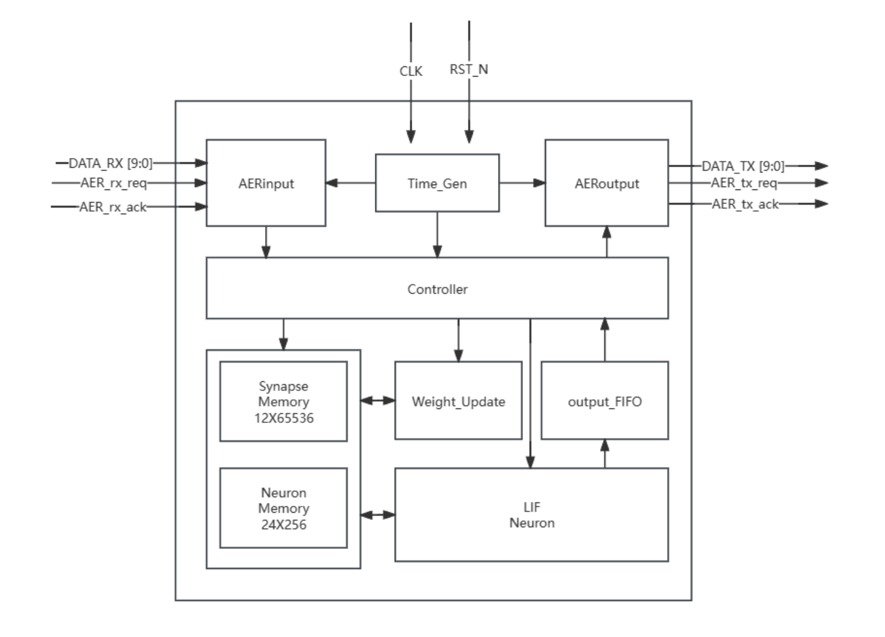
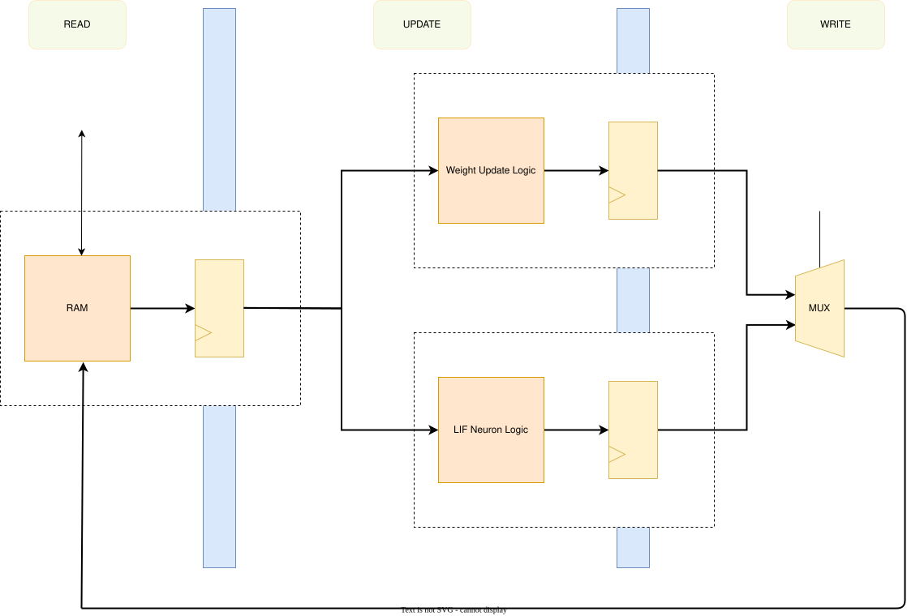

# 模块文档

## 顶层模块说明

模块所属文件：[SNN_Accelerater.sv](./SNN_Accelerater.sv)

### 模块概述

`SNN_Accelerater` 是脉冲神经网络加速器的 **顶层模块**。它集成了时间产生模块、控制模块、AER 输入输出模块、存储模块、LIF 神经元模块和权重更新模块，通过分时复用模拟 256 个 LIF 神经元与 6 万 4 千个突触，支持 STDP / SDSP 两种在线学习算法，并采用赢者通吃策略实现竞争学习。

*参见论文[《基于FPGA的高能效脉冲神经网络硬件加速器设计》](../../吴宗繁%20基于FPGA的高能效脉冲神经网络硬件加速器设计.pdf)第 4.1 节*

---

### 接口概览

| Port name    | Direction/Modport | Type                                  | Description  |
| -------------- | ------------------- | --------------------------------------- | -------------- |
| clk          | input             | logic                                 | 时钟信号     |
| rst_n        | input             | logic                                 | 复位信号     |
| aer_r        | sink              | [aer_if](./submodules_doc/aer_inf.md) | AER 输入接口 |
| aer_t        | source            | [aer_if](./submodules_doc/aer_inf.md) | AER 输出接口 |
| enable_learn | input             | logic                                 | 学习使能     |
| learn_mode   | input             | learn_mode_e                          | 学习模式选择 |

#### 超参数配置

网络规模与学习参数可配置：

| 参数                  | 值                                               | 描述                       |
| ----------------------- | -------------------------------------------------- | ---------------------------- |
| SrcNum / TarNum       | 256                                              | 源 / 目标神经元数量        |
| NeuronConst           | v_thr = 22768, t_ref = 7                         | 神经元阈值与不应期         |
| LearnConst            | xtar = 8, theta_m = 256, ca_theta_1/2/3 = 3/8/13 | STDP / SDSP 学习参数       |
| SrcSpikePerStepMaxExp | SrcNum                                           | 源神经元每步发放最大值预估 |
| SpikePerStepMaxExp    | TarNum                                           | 目神经元每步发放最大值预估 |

---

### 功能描述

#### 工作流程

模块组合各个子模块，形成 SNN 加速器的完整工作流

1. **输入**：AER 输入模块接收外部脉冲数据包，解码后存入双输入缓存 FIFO
2. **调度**：时间产生模块按 `interval` 产生时间步；控制模块在每个时间步内依次执行 UPDATE_I → UPDATE_II →（LEARN）→ IDLE 各阶段，生成存储模块读写地址与各模块控制信号
3. **计算**：存储模块读出神经元 / 突触数据，经 LIF 神经元模块（三级流水）更新并判断发放，在线学习时经权重更新模块更新突触权重
4. **输出**：发放神经元地址写入输出缓存 FIFO；非学习模式下由 AER 输出模块编码发送，学习模式下由控制模块读取用于权重更新

#### 输出 FIFO 控制权仲裁

- **学习模式**：输出缓存 FIFO 归控制模块使用（供权重更新），AER 输出模块禁用
- **非学习模式**：输出缓存 FIFO 归 AER 输出模块使用，控制模块不占用

#### *\*学习使能采样*

*`enable_learn` / `learn_mode` 在时间步边界被采样锁存，保证一个时间步内各模块配置稳定，并据此选择时间步长。*

#### ~~*\*学习模式切换预处理*~~

~~当学习模式发生变化时，模块会将所有突触的学习变量清零，防止不同学习算法间的变量混淆~~ *现有架构无法实现*

---

### 流水线设计

在 SNN 加速器对目标神经元的膜电位的更新过程中，采用了流水线设计，以求最大限度利用所例化的一个物理神经元。

| 阶段        | 功能             |
| ------------- | ------------------ |
| R（Read）   | 读取内存         |
| U（Update） | 更新神经元和突触 |
| W（Write）  | 写回更新结果     |

*参见论文[《基于FPGA的高能效脉冲神经网络硬件加速器设计》](../../吴宗繁%20基于FPGA的高能效脉冲神经网络硬件加速器设计.pdf)图 4-9*

## 子模块、接口、包和 ip 配置文档

子模块：

1. [Neuron_Update_I](./submodules_doc/Neuron_Update_I.md)
2. [Neuron_Update_II](./submodules_doc/Neuron_Update_II.md)
3. [LIF_Neuron](./submodules_doc/LIF_Neuron.md)
4. [aer_rx & aer_tx](./submodules_doc/aer_{r,t}x.md)
5. [AERInput & AEROutput](./submodules_doc/AER{In,Out}put.md)
6. [Time_Gen](./submodules_doc/Time_Gen.md)
7. [Controller](./submodules_doc/Controller.md)

接口：[aer_inf](./submodules_doc/aer_inf.md)

包：[data_types_pkg](./submodules_doc/data_types_pkg.md)

ip 配置：[ip_config/README.md](../ip_config/README.md)
