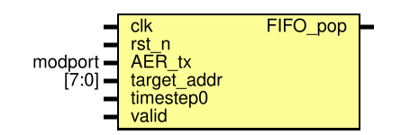

# AER 输入输出模块 README

模块所属文件：

- [srcs\modules\AERInput.sv](../AERInput.sv)
- [srcs\modules\AEROutput.sv](../AEROutput.sv)

## 模块概述

`AERInput` 和 `AEROutput` 是脉冲神经网络加速器中的 **输入输出模块**。它们桥接外部设备的 AER 接口和加速器的控制模块 / 输出 FIFO，是加速器与外部通信的接口。

*参见论文[《基于FPGA的高能效脉冲神经网络硬件加速器设计》](../../../吴宗繁%20基于FPGA的高能效脉冲神经网络硬件加速器设计.pdf)第 4.2、4.6 节*

---

## 接口概览

### AERInput

| Port name   | Direction/Modport | Type        | Description |
| ----------- | ----------------- | ----------- | ----------- |
| clk         | input             | logic       | 时钟信号 |
| rst_n       | input             | logic       | 复位信号 |
| AER_rx      | sink              | [aer_if](./aer_inf.md) | AER 接口 |
| timestep0   | input             | logic       | 当前时间步最低位 |
| FIFO_pop    | input             | logic       | 输入缓存 FIFO 弹出标志 |
| FIFO_empty  | output            | logic       | 输入缓存 FIFO 空标志 |
| source_addr | output            | logic [7:0] | 源神经元地址 |

### AEROutput

| Port name   | Direction/Modport | Type        | Description |
| ----------- | ----------------- | ----------- | ----------- |
| clk         | input             | logic       | 时钟信号 |
| rst_n       | input             | logic       | 复位信号 |
| AER_tx      | source            | [aer_if](./aer_inf.md) | AER 接口 |
| target_addr | input             | logic [7:0] | 发放脉冲的目标神经元地址 |
| timestep0   | input             | logic       | 当前时间步最低位 |
| valid       | input             | logic       | target_addr 有效 |
| FIFO_pop    | output            | logic       | 控制输出缓存 FIFO 弹出 |

---

## 功能描述

### AERInput

SNN 加速器在处理本时间步的数据时，还需要将下一个时间步要处理的数据缓存起来，模块例化 2 个 FIFO 来对数据进行缓存，分别记为 0 号 FIFO 和 1 号 FIFO。

接收外部 AER 脉冲数据包，解码出源神经元编号与时间步信息后写入内部的输入缓存 FIFO 。 0 时刻发放的源神经元脉冲存入 1 号输入缓存 FIFO，1 时刻的源神经元脉冲存入 0 号输入缓存 FIFO。与控制模块交互时，模块选择时间步对应编号的 FIFO 与控制模块交互，将其接口连接到自己的端口上。

### AEROutput

将发放脉冲的目标神经元地址与当前时间步编码为 AER 脉冲数据包，通过异步握手协议发送给外部接收端。传输完成时通过 `FIFO_pop` 弹出输出缓存 FIFO 中的下一个数据。

与输入模块不同，输出缓存 FIFO 并不位于输出模块内部，这是因为在线学习启用时，LIF 神经元模块也需要从输出缓存 FIFO 中取出发放脉冲的目标神经元地址，用于突触权重的更新

*FIFO 控制权的仲裁交由顶层模块完成，学习模式下此模块不启用*

### 脉冲数据包

输入输出模块使用相同的数据包格式：

| 数据包中的位置 | 位宽 | 描述 |
| -------------- | ---- | ---- |
| 7-0            | 8bit | 发放脉冲的神经元编号 |
| 8              | 1bit | 当前时间步标识 |
| 9              | 1bit | 数据包有效标识位，1 有效 |

---

## 子模块文档

1. [aer_rx & aer_tx](./aer_{r,t}x.md)
2. [FIFO ip 核](../../ip_config/README.md)

---

## 时序

见 [aer_rx & aer_tx 文档](./aer_{r,t}x.md)

---

*其它链接*：

- *[顶层模块文档、包和模块文档导航](../README.md)*
