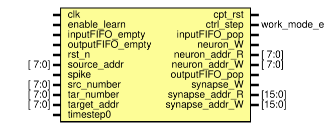
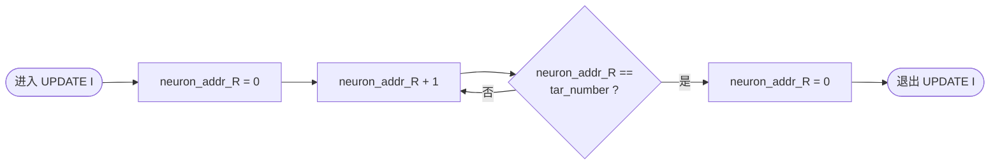
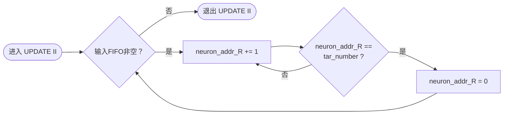
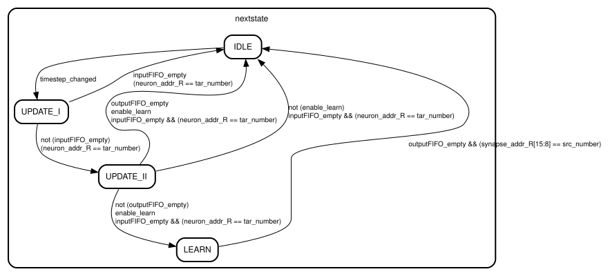

# Controller 模块 README

模块所属文件：[srcs\modules\Controller.sv](../Controller.sv)

## 模块概述

`Controller` 是脉冲神经网络加速器中集中控制个模块工作的核心调度单元，负责协调存储模块、LIF神经元模块、输入/输出FIFO以及在线学习模块之间的数据流与操作时序。

_参见论文[《基于 FPGA 的高能效脉冲神经网络硬件加速器设计》](../../../吴宗繁%20基于FPGA的高能效脉冲神经网络硬件加速器设计.pdf)第 4.5 节_

---

## 接口概览



| Port name         | Direction | Type          | Description   | Pipeline Stage |
| ----------------- | --------- | ------------- | ------------- | :------------: |
| clk               | input     | logic         | 时钟信号          | \\             |
| rst\_n            | input     | logic         | 复位信号          | \\             |
| enable\_learn     | input     | logic         | 启用在线学习        | \\             |
| inputFIFO\_empty  | input     | logic         | 输入缓存 FIFO 空标志 | \\             |
| outputFIFO\_empty | input     | logic         | 输出缓存 FIFO 空标志 | \\             |
| source\_addr      | input     | logic \[7:0]  | 源神经元地址        | \\             |
| target\_addr      | input     | logic \[7:0]  | 目标神经元地址       | \\             |
| src\_number       | input     | logic \[7:0]  | 源神经元启用数量（_移一码_）      | \\             |
| tar\_number       | input     | logic \[7:0]  | 目标神经元启用数量（_移一码_）     | \\             |
| spike             | input     | logic         | 神经元脉冲信号          | W              |
| timestep0         | input     | logic         | 时间步信号         | \\             |
| ctrl\_step        | output    | [work_mode_e](./data_types_pkg.md#work_mode_e) | 计算任务          | U              |
| cpt\_rst          | output    | logic         | 竞争复位          | U              |
| inputFIFO\_pop    | output    | logic         | 输入缓存 FIFO 弹出  | \\             |
| outputFIFO\_pop   | output    | logic         | 输出缓存 FIFO 弹出  | \\             |
| neuron\_addr\_R   | output    | logic \[7:0]  | 神经元 RAM 读地址   | R              |
| neuron\_addr\_W   | output    | logic \[7:0]  | 神经元 RAM 写地址   | W              |
| neuron\_W         | output    | logic         | 神经元 RAM 写使能   | W              |
| synapse\_addr\_R  | output    | logic \[15:0] | 突触 RAM 读地址    | R              |
| synapse\_addr\_W  | output    | logic \[15:0] | 突触 RAM 写地址    | W              |
| synapse\_W        | output    | logic         | 突触 RAM 写使能    | W              |

---

## 功能描述

### 流水线控制

模块集中控制[加速器三级全流水](../README.md#流水线设计)的调度。

- 本模块[状态机](#状态机)的“当前状态”即为 R 级的状态，由于流水线中没有背压，其分别打 1/2 拍即得到 U/W 级的状态
- U 级状态即为执行的计算任务（即`ctrl_step`）
- 根据 W 级的状态，判等即得出 `neuron_W` 和 `synapse_W` 信号
- 读地址打两拍，即得到写地址

### 竞争复位

在本阶段（_实际上仅 `UPDATE II` 状态_），一旦检测到某个目标神经元发放脉冲，即拉高此信号，下一次执行 `UPDATE_I` 时更新模块将据此执行竞争复位，`UPDATE_I` 结束后复位，继续检测本周期是否有发放脉冲。

### 输入输出 FIFO 控制

`UPDATE_II` 状态下，模块将依次从 [AERInput 模块](./AER{In,Out}put.md)读取全部数据（发放脉冲的源神经元地址），组成突触读地址中的源神经元部分。

若启用学习，[输出 FIFO](../../ip_config/README.md) 由本模块控制。`LEARN` 状态下，模块将依次从中读取全部数据（发放脉冲的目神经元地址），组成突触读地址中的目神经元部分。

### RAM 读地址的生成

`UPDATE_I` 和 `UPDATE_II` 阶段下，对神经元 RAM 进行读操作。读地址从 0 开始递增，达到配置的最大启用编号则回绕为 0，若模块能从 FIFO 读取到下一个数据，则循环递增回绕的操作。这样就按顺序读出了每个目标神经元的状态信息，供 LIF 模块进行两种更新操作。





`UPDATE_II` 和 `LEARN` 阶段下，要对突触 RAM 进行读操作。读地址的组成：


- `UPDATE_II` 阶段下，每个源神经元发放的脉冲，都要通过全连接的突触传递给每一个目神经元，故需要读取连接两个神经元的突触信息。源地址来自 [AERInput 模块](./AER{In,Out}put.md)，目标地址与神经元 RAM 的读地址同为地址计数器循环遍历而来。

    ```mermaid
    flowchart LR
        Start([进入 UPDATE II]) --> NextSrc{输入FIFO非空？}
        NextSrc -->|否| End([退出 UPDATE II])
        NextSrc -->|是| GenSrc[i = src_addr]
        GenSrc --> GenAddr["synapse_addr_R = {i, j}"]
        GenAddr --> CheckJ{j == tar_number?}
        CheckJ -->|否| IncJ["j = j + 1"]
        CheckJ -->|是| InitJ["j = 0"]
        IncJ --> GenAddr
        InitJ --> NextSrc
    ```

- `LEARN` 阶段下，每个与发放脉冲的目神经元连接的突触，都要更新权重。源地址同样来自地址计数器，目地址则来自[输出 FIFO](../../ip_config/README.md)。

    ```mermaid
    flowchart LR
        Start([进入 LEARN]) --> NextTar{输出FIFO非空？}
        NextTar -->|否| End([退出 LEARN])
        NextTar -->|是| GenTrg[j = trg_addr]
        GenTrg --> GenAddr["synapse_addr_R = {i, j}"]
        GenAddr --> CheckI{i == src_number?}
        CheckI -->|否| IncI["i = i + 1"]
        IncI --> GenAddr
        CheckI -->|是| InitI["i = 0"]
        NextTar
        InitI --> NextTar
    ```

## 状态机

本模块是一个**四级状态机**，包含 `IDLE`、`UPDATE_I`、`UPDATE_II` 和 `LEARN` 四个状态。状态机的定义在[data_types_pkg](./data_types_pkg.md)中。

状态定义与状态转移：



1. **IDLE（空闲）**：处于等待阶段。当检测到新的时间步开始时，自动跳出空闲状态。
2. **UPDATE_I（泄漏与衰减阶段）**：对当前时间步内所有启用的目标神经元执行统一的膜电位泄漏、不应期递减和钙变量衰减操作。该阶段遍历完所有目标神经元后，若存在待处理的输入脉冲，则进入下一阶段。
3. **UPDATE_II（突触累加与发放阶段）**：逐一处理当前时间步内收到的每个输入脉冲（源神经元）。对于每个脉冲，遍历所有目标神经元，计算突触权重累加并判断神经元是否发放脉冲。当所有输入脉冲处理完毕且无剩余任务时，若未开启学习则回到空闲，若开启学习且有神经元发放则进入学习阶段。
4. **LEARN（在线学习阶段）**：遍历当前时间步内所有发放了脉冲的目标神经元，对其相关的入向突触权重进行更新。所有突触更新完成后，最终回到空闲状态，等待下一个时间步的触发。
