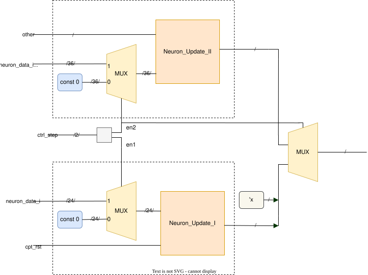

# LIF_Neuron 模块 README

模块所属文件：[srcs\modules\LIF_Neuron.sv](../LIF_Neuron.sv)
仿真文档：[srcs\sim\sim_LIF\README.md](../../sim/sim_LIF/README.md)

## 模块概述

`LIF_Neuron` 是脉冲神经网络加速器中的 **LIF（Leaky Integrate-and-Fire）神经元模块**，实现神经元状态的完整更新。该模块协调 **Neuron_Update_I** 和 **Neuron_Update_II** 两个子模块，根据当前状态分发数据和任务并选择输出来源，存入流水线寄存器并输出。内有操作数隔离以实现低功耗设计。

*参见论文[《基于FPGA的高能效脉冲神经网络硬件加速器设计》](../../../吴宗繁%20基于FPGA的高能效脉冲神经网络硬件加速器设计.pdf)第 3.2 节*

---

## 接口概览

| Port name      | Direction | Type           | Description |
| -------------- | --------- | -------------- | ----------- |
| clk            | input     | logic          | 时钟信号 |
| rst_n          | input     | logic          | 复位信号 |
| cpt_rst        | input     | logic          | 竞争重置信号 |
| ctrl_step      | input     | work_mode_e    | 当前运算阶段状态码 |
| enable_learn   | input     | logic          | 学习使能 |
| learn_mode     | input     | learn_mode_e   | 学习模式 |
| neuron_const   | input     | neuron_const_t | 神经元常数 |
| learn_const    | input     | learn_const_t  | 学习常数 |
| neuron_data_i  | input     | neuron_data_t  | 输入的神经元数据 |
| synapse_data_i | input     | synapse_data_t | 输入的突触数据 |
| neuron_data_o  | output    | neuron_data_t  | 输出的神经元数据 |
| spike          | output    | logic          | 神经元发放脉冲输出 |
| synapse_data_o | output    | synapse_data_t | 输出的突触数据 |

数据类型的定义以及**编码方式**见：

- [data_types_pkg.md](./data_types_pkg.md)
- [《基于FPGA的高能效脉冲神经网络硬件加速器设计》](../../../吴宗繁%20基于FPGA的高能效脉冲神经网络硬件加速器设计.pdf) 表 3-2

---

## 时序

**一级全流水**，打一拍输出。

输入和运算处于顶层三级全流水设计中的 U （运算和更新）阶段，输出处于 W （写回）阶段。

---

## 功能描述

### 数据分发与选择

模块根据 `ctrl_step` 信号的值，将输入数据分发给不同的子模块，并在输出时选择合适的来源。

---

## 低功耗设计

在执行 `UPDATE_I` / `UPDATE_II` 时, 总有一个子模块的输出不被采用，模块会将不被采用的子模块的输入信号恒定置零，以降低频繁翻转带来的功耗。

示意图：

---

## 子模块文档

- **[Neuron_Update_I](./Neuron_Update_II.md)**
- **[Neuron_Update_II](./Neuron_Update_II.md)**

---

*其它链接*：

- *[顶层模块文档、包和模块文档导航](../README.md)*
