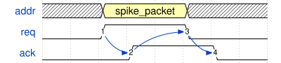

# aer\_inf 接口 README

## 参数

| Name | type | Default value | Description |
| -------------------------------------------------------------------------------------------------------------------------- | ---------------- | ------------- | ------------------- |
| ADDR\_WIDTH | integer unsigned | 10 | 地址线位宽 |
| _INSTABILITY\_WIDTH\_PS\_EXPECT_ | integer unsigned | 0 | _(仿真) 引入不稳定因素的期望时长_ |

## 模块端口

| Port name | Width                                     | Dir(source) | Dir(sink) | Description |
| --------- | ----------------------------------------- | ----------- | --------- | ----------- |
| req       | ADDR\_WIDTH | output      | input     | 发送请求        |
| addr      | 1                                         | output      | input     | 地址线         |
| ack       | 1                                         | input       | output    | 接收应答        |

## 握手时序约定

1. 数据发送端在判断应答信号 ack 为低电平时，将需要传输的脉冲数据包发送到 addr 数据线上，同时将请求信号 req 拉高
2. 数据接收端检测到请求信号 req 变为高电平后，如果接收端处于空闲状态，则将 ack 信号拉高，同时接收脉冲数据包
3. 数据发送端在检测到 ack 信号拉高后，确认接收成功，立刻将 req 信号拉低
4. 数据接收端在检测到 req 信号拉低后，也将 ack 信号拉低，表明此次传输完成。
