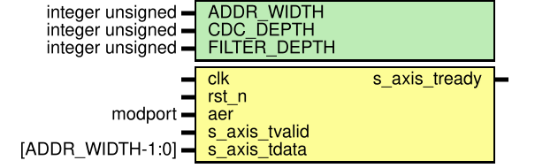
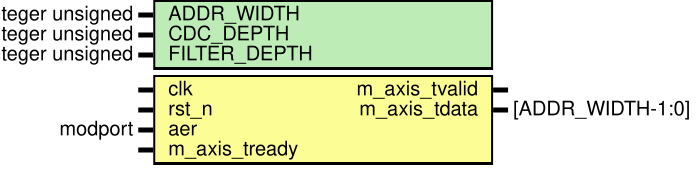
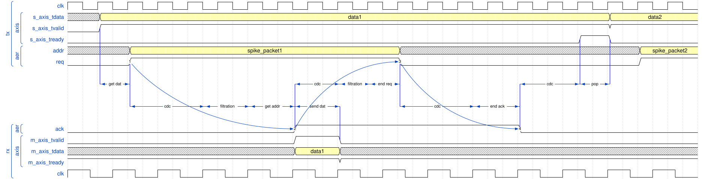

# aer 收发模块 README

模块所属文件：

- [srcs\modules\aer\_rx.sv](../aer_rx.sv)
- [srcs\modules\aer\_tx.sv](../aer_tx.sv)

仿真文档：[srcs/sim/sim_aer/README.md](../../sim/sim_aer/README.md)

## 模块概述

`aer_rx` 和 `aer_tx` 是脉冲神经网络加速器中的 **AER (Address-Event Representation，地址事件表示) 收发模块**。它们与外部 aer 接口交互，经 **跨时钟域同步 (CDC)**、**毛刺滤波** 与 **异步握手应答**，将 AER 协议与最简 AXI4-Stream 协议相互翻译。

---

## 接口概览

aer_tx:

aer_rx:

### 参数

| Name          | type             | Default value | Description         |
| ------------- | ---------------- | ------------- | ------------------- |
| ADDR\_WIDTH   | integer unsigned | 10            | 地址线位宽               |
| CDC\_DEPTH    | integer unsigned | 2             | CDC 同步级数，0 表示无 CDC  |
| FILTER\_DEPTH | integer unsigned | 1             | 滤波窗口深度，最小为 1，即不启用滤波 |

**推荐配置**：

| 输入类型 | 传输场景 | 是否启用 CDC | 是否启用滤波 |
| ---- | --------- | -------- | ------ |
| 异步输入 | 外部输入 | 启用 | 视情况启用 |
| 异步输入 | FPGA 内部传输 | 启用 | 不启用 |
| 同步输入 | FPGA 内部传输 | 不启用 | 不启用 |

### 端口

| Port name           |Direction/Modport| Type                     | Description              |
| ------------------- | --------------- | ------------------------ | ------------------------ |
| clk                 | input           | logic                    | 时钟信号                     |
| rst\_n              | input           | logic                    | 复位信号                     |
| aer                 | _sink / source_ | [aer_if](./aer_inf.md)   | AER 接口                   |
| {m/s}\_axis\_tready | input / output  | logic                    | AXI4-Stream 接收就绪信号       |
| {m/s}\_axis\_tvalid | output / input  | logic                    | AXI4-Stream 数据有效信号       |
| {m/s}\_axis\_tdata  | output / input  | logic \[ADDR\_WIDTH-1:0] | AXI4-Stream 数据 (脉冲数据包地址) |

AER 接口的握手时序约定见：[aer\_inf.md](./aer_inf.md)

---

## 功能描述

### 协议转换

将 AER 协议与最简 AXI4-Stream 协议相互转换

#### 握手信号同步

握手信号为异步输入，为避免亚稳态，将其通过多级触发器同步器同步到本地时钟域，同步级数由 `CDC_DEPTH` 参数配置

#### 毛刺滤波

对同步后的握手信号进行窗口长度为 `FILTER_DEPTH` 的**最小值滤波**

---

## 时序

这里将两个模块的 aer 对接来介绍二者的时序：
_（为方便观察，示例中参数配置为 `CDC_DEPTH = 2`, `FILTER_DEPTH = 2`）_

1. 发送模块 AXIS 从接口的 vld 信号拉高后，模块将 data 寄存给 AER 地址线线的输出寄存器，并拉高请求
2. 接收模块经跨时钟域同步和滤波，确认请求被拉高。若上一次 AXIS 握手已经完成（数据有效信号为低），就将数据从地址线寄存到 AXIS 数据线的输出寄存器，同时给出 vld 指示，并返回应答。
3. 1. 接收模块等到与下游模块握手成功后，拉低 vld 。此时接收端的 AXIS 传输完成。若握手一直未成功，则之后会向上游传递背压，阻塞下一次 AER 传输。
   2. 发送模块经跨时钟域同步和滤波，确认收到应答后，将请求拉低。
4. 接收模块经跨时钟域同步，确认请求被拉低。_由于采用最小值滤波，同步完成后滤波输出立刻置 0 ，故此处没有滤波耗时_。在下一个上升沿，模块将应答线也拉低。
5. 发送模块经跨时钟域同步，确认应答被拉低。_同上，这里也没有滤波耗时_。此时一次 AER 传输完成。模块拉高 ready 信号，示意 AXIS 主机可以流出旧数据，更换新数据进行下一次传输。

理想情况下一次 AER 传输的大致周期：（_此处假设 AER 握手信号紧随对侧时钟上升沿之后变化，实际情况可能更快，也可能因对侧采到亚稳态而更慢_）
\[T = (CDC\_DEPTH\_T \cdot 2 + FILTER\_DEPTH\_T + 2) \cdot T_{tclk} + (CDC\_DEPTH\_R \cdot 2 + FILTER\_DEPTH\_R + 1) \cdot T_{rclk}\]

_[aer_loop 模块](../aer_loop.sv) 就实现了这样一个对传。该模块用于在仿真测试中一次性测试两个模块的正确性_

---

_其它链接_：

- _[顶层模块文档、包和模块文档导航](../README.md)_
