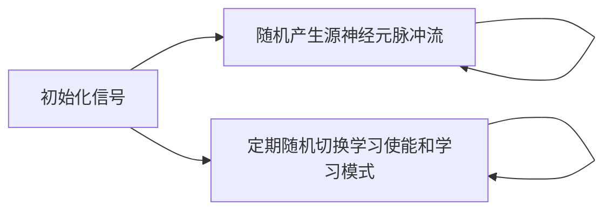
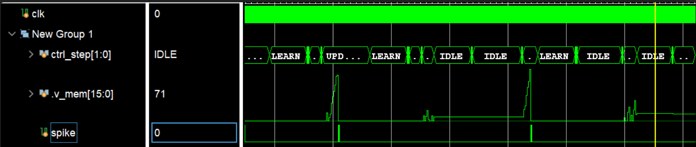
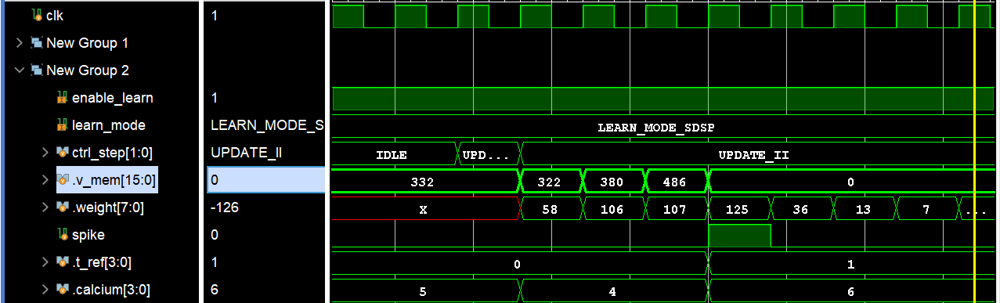

# LIF 神经元仿真验证

| 代码文件 | 路径 |
| -------- | ---- |
| 测试平台 | [srcs/sim/sim_LIF/sim_LIF_tb.sv](./sim_LIF_tb.sv) |
| 待测模块 | [srcs/modules/LIF_Neuron.sv](../../modules/LIF_Neuron.sv) |
| 模块文档 | [srcs/modules/submodules_doc/LIF_Neuron.md](../../modules/submodules_doc/LIF_Neuron.md) |

## 运行仿真

1. 打开 Vivado 工程
2. IP Sources 中，右击 BRAM_12X65536 更改配置，载入 coe 文件 [synapse_mem_almost_pos.coe](./synapse_mem_almost_pos.coe) （*文件由[synapse_mem_almost_pos_coe_gen.py](./synapse_mem_almost_pos_coe_gen.py)生成*）
3. 在 Simulation Sources 中，将 sim_LIF 设为 active
4. 运行 Run Simulation 启动仿真

## 仿真概览

本仿真验证依照论文[《基于FPGA的高能效脉冲神经网络硬件加速器设计》](../../吴宗繁%20基于FPGA的高能效脉冲神经网络硬件加速器设计.pdf)的 5.1.1 章节编写代码，将 LIF 神经元放在加速器中，验证其在加速器中能正确工作。

仿真流程：

数据流：

*加速器配置*：

| 参数 | 默认值 |
| ---- | -- |
| SrcNum | 32 |
| TarNum | 1 |
| NeuronConst | v_thr = 500, t_ref = 1 |
| LearnConst | default |

## 验证与调试

本仿真通过人工观察波形来验证正确性。

group 1 对应论文图 5-1

group 2 对应论文图 5-2 和 5-3

*波形配置文件：[srcs/sim/sim_LIF/sim_LIF_tb_behav.wcfg](./sim_LIF_tb_behav.wcfg)*
