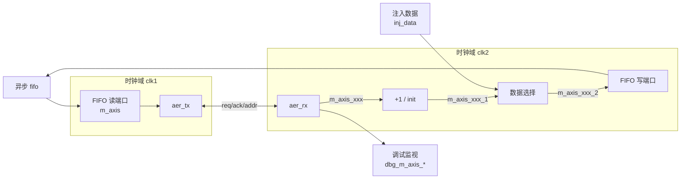
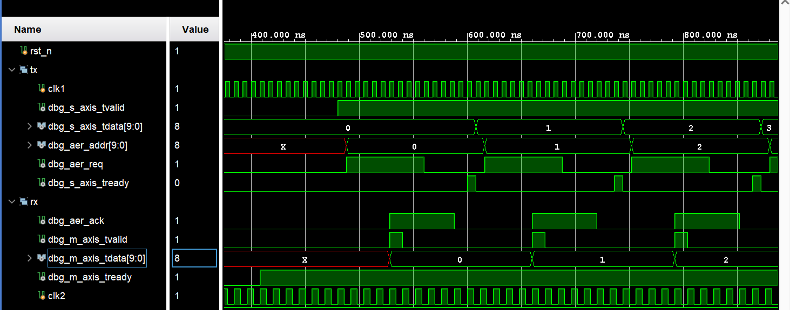
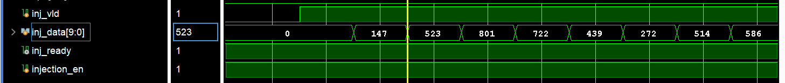
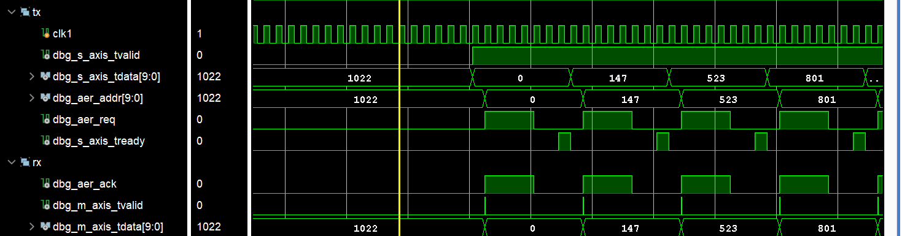
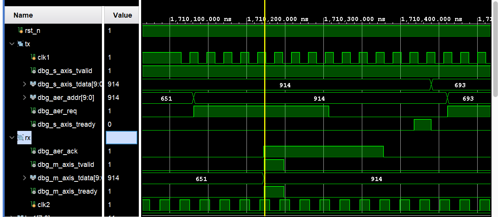

# aer 模块仿真验证（回环组合测试）

| 代码文件 | 路径 |
| -------- | ---- |
| 测试平台 | [srcs/sim/sim_aer/aer_loop_tb.sv](./aer_loop_tb.sv) |
| 回环集成模块 | [srcs/modules/aer_loop.sv](../../modules/aer_loop.sv) |
| 待测模块 | [srcs/modules/aer_tx.sv](../../modules/aer_tx.sv) & [srcs/modules/aer_rx.sv](../../modules/aer_rx.sv) |
| 模块文档 | [srcs/modules/submodules_doc/aer_{r,t}x.md](../../modules/submodules_doc/aer_{r,t}x.md) |

## 运行仿真

1. 打开 Vivado 工程
2. 在 Simulation Sources 中，将 sim_aer 设为 active
3. 运行 Run Simulation 启动仿真

<!-- *可以进行综合/实现后仿真*：

1. 在 Constraints 中，将 constrs_aer_loop 设为 active，进行综合 / 实现
2. 
3. 运行 tcl 命令

    ```bash
    set_msg_config -suppress -string {cdc_sync_inst}
    set_msg_config -suppress -string {m_axis_tdata_sync_reg}
    ```

4. 综合 / 实现完成后运行 Run Simulation ，选择后仿，启动仿真 -->

## 仿真概览

本仿真将 `aer_tx`、`aer_rx` 与异步 FIFO（AERTestFifo）组合成一个数据回环，整体验证多模块在双异步时钟域下协同工作的正确性。

### 回环架构

测试平台将三个 DUT 通过 AER 总线与异步 FIFO 首尾相接，数据在回环中持续流动：



- **闭环自累加路径**（`injection_en = 0`）：  
  `aer_rx` 接收到的数据加 1 后，通过多路选择器进入 FIFO 写端口，经跨时钟域 FIFO 送到 `aer_tx`，再通过 AER 接口发回 `aer_rx`，形成闭环递增测试流。*模块复位结束后 / 开环恢复闭环时会内部注入一个 0*
- **开环注入路径**（`injection_en = 1`）：  
  外部 `inj_data` 直接送入 FIFO，经 `aer_tx` → AER 接口 → `aer_rx` 输出到调试端口，此时环路被切断，数据不再累加回环。

### 双异步时钟

`clk1`（TX 侧）与 `clk2`（RX 侧）为**异步时钟**，其半周期 `hp1`/`hp2` 在仿真过程中定期随机变化，覆盖多种频率关系，检验 AER 握手与 FIFO 在任意时钟关系下的跨时钟域可靠性。

| 编号 | clk1 半周期 | clk2 半周期 | 频率关系 | 其它说明 |
| :--- | :--- | :--- | :--- | :--- |
| 0 | 8 ns | 12 ns | 3 : 2 | 初始化时设置，即为[模块文档中时序图](../../modules/submodules_doc/aer_{r,t}x.md#时序)的频率关系 |
| 1 | 6 ~ 10 ns | 60 ~ 100 ns | clk1 快、clk2 慢 | 中途随机设置 |
| 2 | 60 ~ 100 ns | 6 ~ 10 ns | clk1 慢、clk2 快 | 中途随机设置 |
| 3 | 10 ~ 15 ns | 10 ~ 15 ns | 随机相近 | 中途随机设置 |
| 4 | 600 ns | 6 ns | 极端悬殊 | 注入前几百个数据时设置，造成异步 fifo 拥堵 |

### 测试项目

| 测试项 | 输入条件 | 预期行为 | 检查方式 |
| :--- | :--- | :--- | :--- |
| **TEST 1** | 回环自增模式（`injection_en=0`） | 数据每次回环 `+1`，`dbg_m_axis_tdata` 依次输出 0, 1, 2, ..., 3ff | 自动检验 |
| **TEST 2** | 注入 1023 个随机数据 | 注入数据绕一圈后按序原样输出 | 自动比对 |

## 验证与调试

### 控制台信息

测试平台含有自动比对功能，最终汇总打印总错误数。

#### 成功示例

```log

...... 

test over, total errors: 0
```

#### 失败示例

任一比对不一致即打印错误并中断：

```log

......

[error|2042950000] Expected  605, got  907
Simulation completed: SOME CHECKS FAILED
Total errors: 11
```

出现 `ERROR` 说明回环中存在丢数、乱序或数据损坏，需要结合波形和控制台日志输出定位。

### 波形

可通过波形直观地查看回环中 AER 握手与跨时钟域传输过程。

波形按功能分组，便于对照观察：

| 分组 | 信号 | 作用 |
| :--- | :--- | :--- |
| **tx** | `clk1`、`dbg_s_axis_tvalid`、`dbg_s_axis_tdata`、`dbg_aer_addr`、`dbg_aer_req`、`dbg_s_axis_tready` | TX 侧协议转换 |
| **rx** | `dbg_aer_ack`、`dbg_m_axis_tvalid`、`dbg_m_axis_tdata`、`dbg_m_axis_tready`、`clk2` | RX 侧协议转换 |
| 其它 | 略 | 自选调试信号 |

开始时，时钟频率比为 3:2 ，可观察到波形符合[模块文档中时序图](../../modules/submodules_doc/aer_{r,t}x.md#时序)，同时数据依次递增



极高密度注入时，可观察到 fifo 装满而导致数据通路堵塞，但是数据没有因此丢失




布局布线后运行后仿：



*波形配置文件：[srcs/sim/sim_aer/aer_loop_tb_behav.wcfg](./aer_loop_tb_behav.wcfg)*
