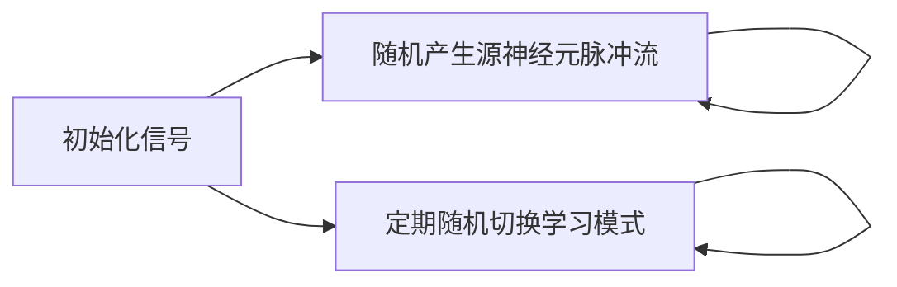
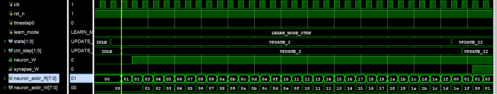
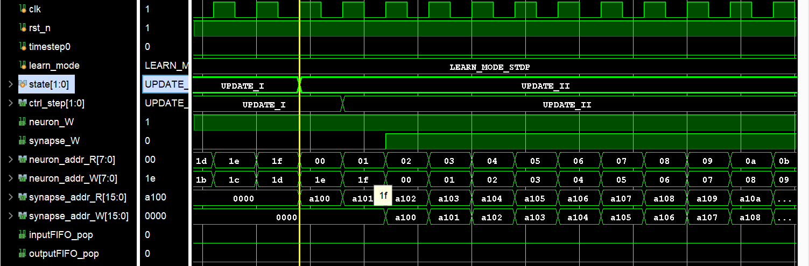
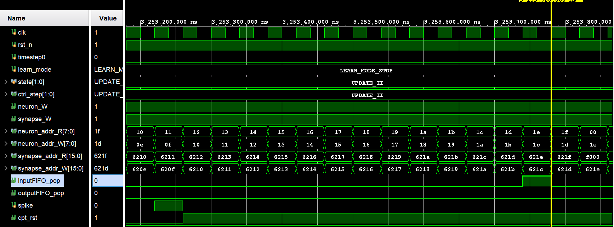
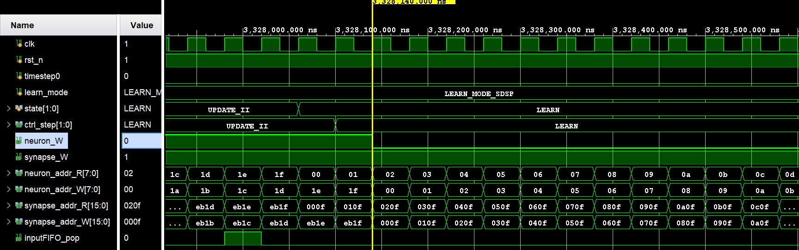
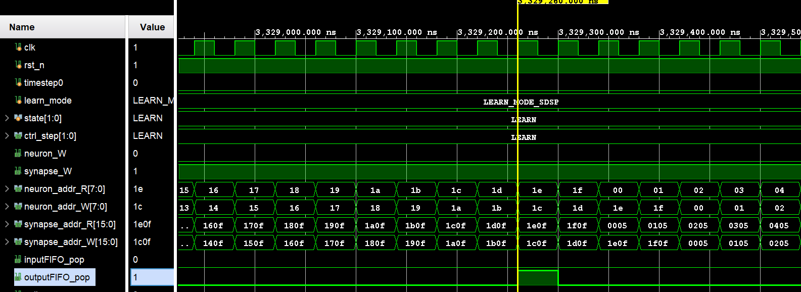

# Controller 模块仿真验证

| 代码文件 | 路径 |
| -------- | ---- |
| 测试平台 | [srcs/sim/sim_cu/tb_Controller.sv](./tb_Controller.sv) |
| 待测模块 | [srcs/modules/Controller.sv](../../modules/Controller.sv) |
| 模块文档 | [srcs/modules/submodules_doc/Controller.md](../../modules/submodules_doc/Controller.md) |

## 运行仿真

1. 打开 Vivado 工程
2. 在 Simulation Sources 中，将 sim_cu 设为 active
3. 运行 Run Simulation 启动仿真

## 仿真概览

本仿真验证依据论文[《基于FPGA的高能效脉冲神经网络硬件加速器设计》](../../吴宗繁%20基于FPGA的高能效脉冲神经网络硬件加速器设计.pdf)的 4.5 章节编写代码，将 Controller 模块（加速器控制单元）放在加速器中，通过查看波形验证其正确性。

仿真流程：

数据流：

*加速器配置*：

| 参数 | 默认值 |
| ---- | -- |
| SrcNum | 32 |
| TarNum | 32 |
| NeuronConst | v_thr = 500, t_ref = 1 |
| LearnConst | default |

## 验证与调试

本仿真通过人工观察波形来验证正确性。

观察要点：

1. **状态机流转**：`state` 应依次经历 `IDLE → UPDATE_I → UPDATE_II → LEARN → IDLE`，转换时机符合状态转移图。
2. **神经元地址生成**：`neuron_addr_R` 从 0 递增至 `tar_number` 后回绕为 0，循环遍历所有目标神经元；`neuron_addr_W` 为读地址延迟两拍。
3. **突触地址生成**：`UPDATE_II` 时目地址累加，原地址来自输入；`LEARN` 时源地址累加，目地址来自输入。
4. **FIFO 弹出**：`inputFIFO_pop` 在 `UPDATE_II` 处理完最后一个目标神经元前拉高；`outputFIFO_pop` 在 `LEARN` 处理完最后一个源神经元前拉高。
5. **竞争复位**：`UPDATE_II` 且 `spike` 为高时 `cpt_rst` 置 1，`UPDATE_I` 遍历结束后复位。
6. **写使能**：`neuron_W` 在 W 级为 `UPDATE_I` / `UPDATE_II` 时为高；`synapse_W` 在 W 级为 `LEARN` 或（`UPDATE_II` 且使能学习）时为高。

`IDLE` 向 `UPDATE_I` 跳转，以及 `UPDATE_I` 状态下神经元内存的读写：

`UPDATE_I` 向 `UPDATE_II` 跳转，以及 `UPDATE_II` 状态下内存的读写：

`UPDATE_II` 状态下输入 FIFO 的控制以及 `cpt_rst` 信号的生成：

`UPDATE_II` 向 `LEARN` 跳转，以及 `LEARN` 状态下突触内存的读写：

`LEARN` 状态下输出 FIFO 的控制：

*波形配置文件：[srcs/sim/sim_cu/tb_Controller_behav.wcfg](./tb_Controller_behav.wcfg)*
