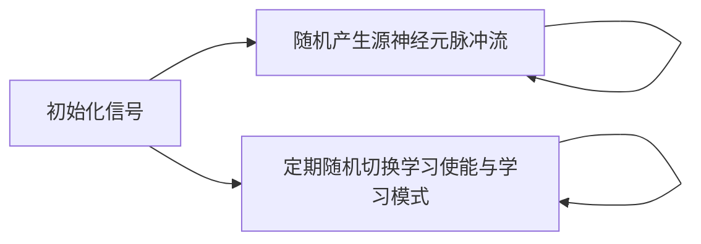
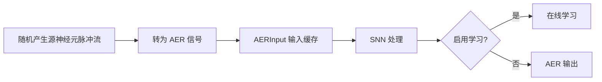
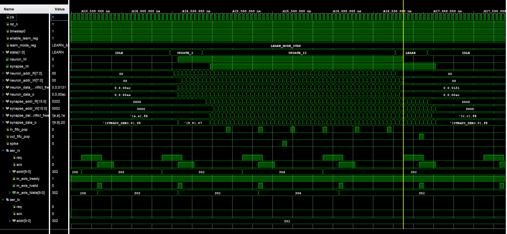

# SNN_Accelerater 仿真验证

| 代码文件 | 路径 |
| -------- | ---- |
| 测试平台 | [srcs/sim/sim_snn_acc/tb_SNN_Accelerater.sv](./tb_SNN_Accelerater.sv) |
| 待测模块 | [srcs/modules/SNN_Accelerater.sv](../../modules/SNN_Accelerater.sv) |

## 运行仿真

1. 打开 Vivado 工程
2. 在 Simulation Sources 中，将 sim_snn_acc 设为 active
3. 运行 Run Simulation 启动仿真

## 仿真概览

本仿真对 SNN 加速器顶层模块进行整体验证，以 8 × 8 全连接小网络为例，将随机产生的源神经元脉冲流经 AER 输入送入加速器，验证加速器各模块是能否正确协同工作。

仿真流程：

数据流：

*加速器配置*：

| 参数 | 默认值 |
| ---- | -- |
| SrcNum | 8 |
| TarNum | 8 |
| NeuronConst | v_thr = 500, t_ref = 1 |
| LearnConst | default |
| SrcSpikePerStepMaxExp | 8 |
| SpikePerStepMaxExp | 8 |

## 验证与调试

本仿真通过人工观察波形来验证正确性。波形同时观测了控制器内部状态、存储读写、神经元/突触数据与 AER 收发接口，可自上而下核对整条数据通路。

由于学习模式和学习使能随机切换，可在波形中观察到论文图 5-18 至 5-24 所示的所有现象。

*波形配置文件：[srcs/sim/sim_snn_acc/tb_SNN_Accelerater_behav.wcfg](./tb_SNN_Accelerater_behav.wcfg)*
