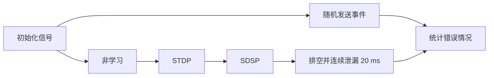
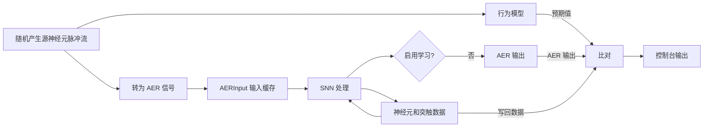

# SNN_Accelerater 仿真验证

| 代码文件 | 路径 |
| -------- | ---- |
| 测试平台 | [srcs/sim/sim_snn_acc/tb_SNN_Accelerater.sv](./tb_SNN_Accelerater.sv) |
| 待测模块 | [srcs/modules/SNN_Accelerater.sv](../../modules/SNN_Accelerater.sv) |

## 运行仿真

1. 打开 Vivado 工程
2. 在 Simulation Sources 中，将 sim_snn_acc 设为 active
3. 运行 Run Simulation 启动仿真

## 验证内容

测试平台采用 8 × 8 网络，向 AER 输入发送 3 组、每组 3000 个有限随机事件，依次覆盖非学习、STDP 和 SDSP 模式。事件发送完成后继续运行 20 ms，使输入 FIFO 排空并观察连续泄漏。

测试平台使用 DUT 实际 RAM 仿真模型的 `memory` 数组初始化参考内存，因此更换 COE 后无需修改测试平台。参考模型自动检查：

- 神经元和突触读写地址范围；
- 神经元泄漏、不应期、积分、阈值发放和竞争复位；
- STDP / SDSP 学习变量及权重更新；
- AER 输出事件数量及目标地址范围；`Weight_Update` 的详细算法由独立测试平台验证。

仿真流程：



数据流：



*加速器配置*：

| 参数 | 默认值 |
| ---- | -- |
| SrcNum | 8 |
| TarNum | 8 |
| NeuronConst | v_thr = 500, t_ref = 1 |
| LearnConst | default |

## 结果报告

仿真结束时统一输出检查数量和错误数，并以错误数作为返回值

通过示例：

```log
[info|0] Logger initialized!
 ===== SNN_Accelerater self-checking test =====
 [info|20000] Sending 10000 events without learning
 [info|3002350000] Sending 10000 events with STDP learning
 Waiting for FIFO to drain...
 [info|26002313000] Steped for 20000000 ns to drain the FIFO
 [info|26006350000] Sending 10000 events with SDSP learning
 Waiting for FIFO to drain...
 [info|49006313000] Steped for 20000000 ns to drain the FIFO
 [info|49006313000] Checked reads=252597 writes=413784 outputs=4014
 Simulation completed: ALL CHECKS PASSED
 Total errors: 0
```

失败示例：

```log

......

[error|29050450000] [SNN_Accelerater] UPDATE_II address out of range: neuron=6 synapse=2054
[error|29050450000] [SNN_Accelerater] synapse write address out of range: 2052
[error|29050475000] [SNN_Accelerater] UPDATE_II address out of range: neuron=7 synapse=2055
[error|29050475000] [SNN_Accelerater] synapse write address out of range: 2053
[error|29050500000] [SNN_Accelerater] synapse write address out of range: 2054
[error|29050525000] [SNN_Accelerater] synapse write address out of range: 2055
[info|49006313000] Steped for 20000000 ns to drain the FIFO
[info|49006313000] Checked reads=252597 writes=413784 outputs=4014
Simulation completed: SOME CHECKS FAILED
Total errors: 45003
```

可通过查看波形进行调试

*波形配置文件：[srcs/sim/sim_snn_acc/tb_SNN_Accelerater_behav.wcfg](./tb_SNN_Accelerater_behav.wcfg)*
