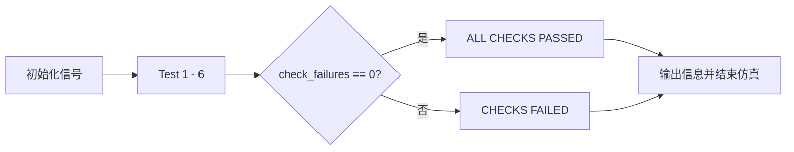
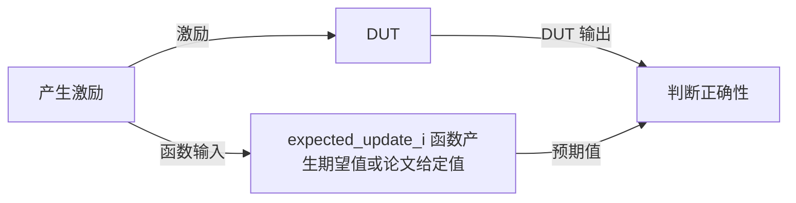
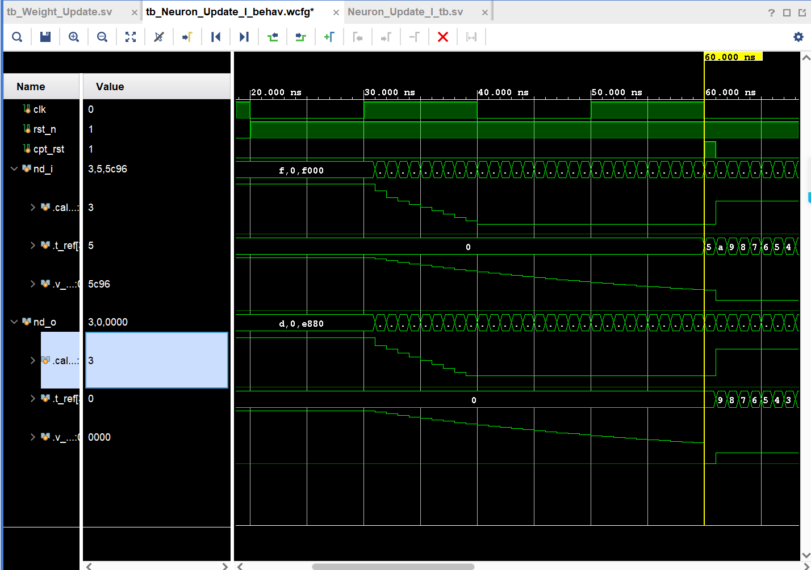

# Neuron_Update_I 仿真验证

| 代码文件 | 路径 |
|------|------|
| 测试平台 | [srcs/sim/sim_upd_1/Neuron_Update_I_tb.sv](./Neuron_Update_I_tb.sv)|
| 待测模块 | [srcs/modules/Neuron_Update_I.sv](../../modules/Neuron_Update_I.sv) |
| 模块文档 | [srcs/modules/submodules_doc/Neuron_Update_I.md](../../modules/submodules_doc/Neuron_Update_I.md) |

## 运行仿真

1. 打开 Vivado 工程
2. Simulation Sources 中， 将 sim_upd_1 设为 active
3. Run Simulation 启动仿真

## 仿真概览

仿真流程：



数据流：



*测试平台采用双源比对策略， 激励同时送入 DUT 和纯 SystemVerilog 行为模型 `expected_update_i`。*

测试项目：

| 测试项 | 输入条件 | 行为 | 检查方式 |
| :--- | :--- | :--- | :--- |
| **Test 1** | `cpt_rst=0`，`t_ref = 0` | 膜电位和钙离子近似指数衰减 | 自动检验 |
| **Test 2** | `cpt_rst=1` | 膜电位和不应期清零，钙离子保持当前值不变 | 自动检验 |
| **Test 3** | `t_ref` != 0 | `v_mem` 不衰减，`t_ref` 减一 | 自动检验 |
| **Test 4** | `v_mem` 接近 0 输入 | 稳定在较低值 | 人工检验 |
| **Test 5** | 论文 5.1.1 给定输入 | 输出与论文所写一致 | 自动检查 |
| **Test 6** | 舍入边界检查 | 泄漏至某一点后泄漏速度减一 | 人工检验 |

## 验证与调试

### 控制台信息

测试平台含有自动验证功能，验证信息将输出至控制台
仿真结束后，查看控制台是否有 `ALL CHECKS PASSED` 消息即可确认模块正确性。

#### 成功示例

```txt
===== Test 1: Leakage and Calcium decay =====
[31000] Test 1: nd_i=v_mem=0xf000 (480.000000)(61440), t_ref=0, calcium=15
   PASS: v_mem=0xe880 (465.000000)(59520), t_ref=0, calcium=13
[32000] Test 1: nd_i=v_mem=0xe880 (465.000000)(59520), t_ref=0, calcium=13
   PASS: v_mem=0xe13c (450.468750)(57660), t_ref=0, calcium=11
[33000] Test 1: nd_i=v_mem=0xe13c (450.468750)(57660), t_ref=0, calcium=11
   PASS: v_mem=0xda32 (436.390625)(55858), t_ref=0, calcium=10

......

===== Test 2: Competitive reset (cpt_rst=1) =====
[61000] Test 2: nd_i=v_mem=0x5c96 (185.171875)(23702), t_ref=5, calcium=3
   PASS: v_mem=0x0000 (0.000000)(0), t_ref=0, calcium=3

===== Test 3: Refractory period decrement =====
[62000] Test 3: nd_i=v_mem=0x3000 (96.000000)(12288), t_ref=10, calcium=10
   PASS: v_mem=0x3000 (96.000000)(12288), t_ref=9, calcium=10
[63000] Test 3: nd_i=v_mem=0x3000 (96.000000)(12288), t_ref=9, calcium=10
   PASS: v_mem=0x3000 (96.000000)(12288), t_ref=8, calcium=10
[64000] Test 3: nd_i=v_mem=0x3000 (96.000000)(12288), t_ref=8, calcium=10
   PASS: v_mem=0x3000 (96.000000)(12288), t_ref=7, calcium=10

......

===== Test 4: Stabilization near zero =====
[77000] Test 4: nd_i=v_mem=0x0012 (0.140625)(18), t_ref=0, calcium=1
   PASS: v_mem=0x0011 (0.132812)(17), t_ref=0, calcium=1
[78000] Test 4: nd_i=v_mem=0x0011 (0.132812)(17), t_ref=0, calcium=1
   PASS: v_mem=0x0010 (0.125000)(16), t_ref=0, calcium=1
[79000] Test 4: nd_i=v_mem=0x0010 (0.125000)(16), t_ref=0, calcium=1
   PASS: v_mem=0x000f (0.117188)(15), t_ref=0, calcium=1
[80000] Test 4: nd_i=v_mem=0x000f (0.117188)(15), t_ref=0, calcium=1
   PASS: v_mem=0x000f (0.117188)(15), t_ref=0, calcium=1

......

===== Test 5: Consistency with paper =====
[85000] Test 5: nd_i=v_mem=0x02e8 (5.812500)(744), t_ref=0, calcium=7
   PASS: v_mem=0x02d1 (5.632812)(721), t_ref=0, calcium=6

===== Test 6: Boundary rounding =====
[86000] Test 6a i: nd_i=v_mem=0x002f (0.367188)(47), t_ref=0, calcium=0
   PASS: v_mem=0x002e (0.359375)(46), t_ref=0, calcium=0
[87000] Test 6a ii: nd_i=v_mem=0x0030 (0.375000)(48), t_ref=0, calcium=0
   PASS: v_mem=0x002e (0.359375)(46), t_ref=0, calcium=0
[88000] Test 6a iii: nd_i=v_mem=0x0031 (0.382812)(49), t_ref=0, calcium=0
   PASS: v_mem=0x002f (0.367188)(47), t_ref=0, calcium=0

......

===== Simulation completed: ALL CHECKS PASSED =====
```

#### 失败示例

若校验失败，输出将显示具体错误：

```txt

......

Error: [631000] Test 2 FAIL
  expected: v_mem=0x0000 (0.000000), t_ref=0, calcium=3
  actual  : v_mem=0x0000 (0.000000), t_ref=0, calcium=0
Time: 631 ns  Iteration: 0  Process: /tb_Neuron_Update_I/check_neuron_data  Scope: tb_Neuron_Update_I.check_neuron_data  File: xxx/srcs/sim/sim_upd_1/Neuron_Update_I_tb.sv Line: 59

......

Fatal: 
===== Simulation completed: 1 CHECK(S) FAILED =====
```

### 波形

可通过波形直观地查看运行结果或查看内部信号



*波形配置文件：[srcs\sim\sim_upd_1\tb_Neuron_Update_I_behav.wcfg](./tb_Neuron_Update_I_behav.wcfg)*
