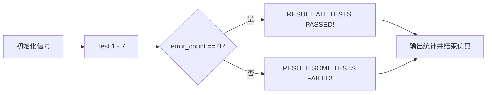
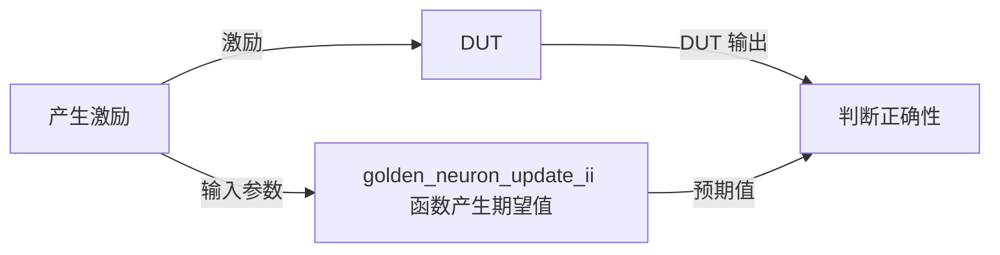
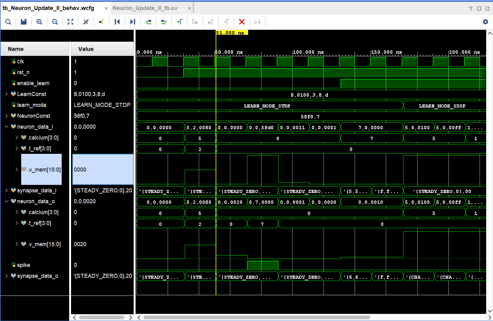

# Neuron_Update_II 仿真验证

| 代码文件 | 路径 |
| -------- | ---- |
| 测试平台 | [srcs/sim/sim_upd_2/Neuron_Update_II_tb.sv](./Neuron_Update_II_tb.sv) |
| 待测模块 | [srcs/modules/Neuron_Update_II.sv](../../modules/Neuron_Update_II.sv) |
| 模块文档 | [srcs/modules/submodules_doc/Neuron_Update_II.md](../../modules/submodules_doc/Neuron_Update_II.md) |

## 运行仿真

1. 打开 Vivado 工程
2. 在 Simulation Sources 中，将 sim_upd_2 设为 active
3. 运行 Run Simulation 启动仿真

## 仿真概览

仿真流程：



数据流：



*测试平台采用双源比对策略，激励同时送入 DUT 和纯 SystemVerilog 行为模型 `golden_neuron_update_ii`。*

测试项目：

| 测试项 | 输入条件 | 行为 | 检测方式 |
| :--- | :--- | :--- | :--- |
| **Test 1** | `t_ref > 0` | 不应期内 `v_mem` 保持不变，`t_ref` 递减 | 自动 |
| **Test 2** | `t_ref = 0`, 正权重输入 | `v_mem` 累加,`v_mem + weight >= v_thr` 则触发发放 | 自动 |
| **Test 3a** | 负权重输入且结果仍为正 | `v_mem` 下降 | 自动 |
| **Test 3b** | 负权重输入导致下溢 | `v_mem` 钳位到 0 | 自动 |
| **Test 4** | `enable_learn = 1`, `learn_mode = LEARN_MODE_STDP` | `calcium` 清零，`x_pre` 递增，最多增到 15 | 自动 |
| **Test 5a** | `learn_mode = LEARN_MODE_SDSP`, 满足正向条件 | `synapse_change_dir == CHANGE_INCR` | 自动 |
| **Test 5b** | `learn_mode = LEARN_MODE_SDSP`, 满足负向条件 | `synapse_change_dir == CHANGE_DECR` | 自动 |
| **Test 5c** | `calcium` 不在阈值区间 | `synapse_change_dir == STEADY_ZERO \| synapse_change_dir ==  STEADY_ONE` | 自动 |
| **Test 5d** | 发放脉冲时进入 SDSP | `calcium` 增加 `Jc`，并按条件更新方向编码 | 自动 |
| **Test 6** | `enable_learn = 0` | 只执行神经元更新，不执行学习逻辑 | 自动 |
| **Test 7** | 不应期内开启学习 | `v_mem` 保持不变，同时学习逻辑仍生效 | 自动 |

## 验证与调试

### 控制台信息

测试平台含有自动验证功能，验证信息将输出至控制台。
仿真结束后，查看控制台是否有 `RESULT      : ALL TESTS PASSED!` 消息即可确认模块正确性。

#### 成功示例

```log

[info|0] Logger initialized!
 
========== START SELF-CHECKING TEST ==========

 --- Test 1: Refractory period suppression ---
 [info|51000] T1_Refractory:
 neuron_i=v_mem=0x0080 (1.000000)(128), t_ref=2, calcium=5
  synapse_i=weight=0x10 (0.125000)(16), learn_var= 0
 neuron_o=v_mem=0x0080 (1.000000)(128), t_ref=2, calcium=5
  synapse_o=weight=0x10 (0.125000)(16), learn_var= 0
 spike=0
 [info|51000] [PASS]  T1_Refractory
 
--- Test 2: Positive weight accumulation & fire ---
 [info|111000] T2a_Pos_Accum:
 neuron_i=v_mem=0x58be (177.484375)(22718), t_ref=0, calcium=5
  synapse_i=weight=0x10 (0.125000)(16), learn_var= 0
 neuron_o=v_mem=0x58ce (177.609375)(22734), t_ref=0, calcium=5
  synapse_o=weight=0x10 (0.125000)(16), learn_var= 0
 spike=0
 [info|111000] [PASS]  T2a_Pos_Accum

......
 
--- Test 3: Negative weight (inhibition) ---
 [info|231000] T3a_Neg_Accum:
 neuron_i=v_mem=0x0011 (0.132812)(17), t_ref=0, calcium=5
  synapse_i=weight=0xf0 (-0.125000)(-16), learn_var= 0
 neuron_o=v_mem=0x0001 (0.007812)(1), t_ref=0, calcium=5
  synapse_o=weight=0xf0 (-0.125000)(-16), learn_var= 0
 spike=0
 [info|231000] [PASS]  T3a_Neg_Accum

......
 
--- Test 4: STDP learning mode ---
 [info|331000] T4a_STDP_Basic:
 neuron_i=v_mem=0x0000 (0.000000)(0), t_ref=0, calcium=7
  synapse_i=weight=0x10 (0.125000)(16), learn_var= 5
 neuron_o=v_mem=0x0010 (0.125000)(16), t_ref=0, calcium=0
  synapse_o=weight=0x10 (0.125000)(16), learn_var= 6
 spike=0
 [info|331000] [PASS]  T4a_STDP_Basic

......
 
--- Test 5: SDSP learning mode ---
 [info|411000] T5a_SDSP_Pos:
 neuron_i=v_mem=0x0100 (2.000000)(256), t_ref=0, calcium=5
  synapse_i=weight=0x00 (0.000000)(0), learn_var= 0
 neuron_o=v_mem=0x0100 (2.000000)(256), t_ref=0, calcium=5
  synapse_o=weight=0x00 (0.000000)(0), learn_var= 1
 spike=0
 [info|411000] [PASS]  T5a_SDSP_Pos

......
 
--- Test 6: Learning disabled ---
 [info|571000] T6_Learn_Disabled:
 neuron_i=v_mem=0x0100 (2.000000)(256), t_ref=0, calcium=3
  synapse_i=weight=0x10 (0.125000)(16), learn_var= 5
 neuron_o=v_mem=0x0110 (2.125000)(272), t_ref=0, calcium=3
  synapse_o=weight=0x10 (0.125000)(16), learn_var= 5
 spike=0
 [info|571000] [PASS]  T6_Learn_Disabled
 
--- Test 7: Learning during refractory (STDP) ---
 [info|611000] T7_Refractory_Learn:
 neuron_i=v_mem=0x0100 (2.000000)(256), t_ref=3, calcium=9
  synapse_i=weight=0x10 (0.125000)(16), learn_var= 2
 neuron_o=v_mem=0x0100 (2.000000)(256), t_ref=3, calcium=0
  synapse_o=weight=0x10 (0.125000)(16), learn_var= 3
 spike=0
 [info|611000] [PASS]  T7_Refractory_Learn
 Simulation completed: ALL CHECKS PASSED
 Total errors: 0
```

#### 失败示例

若校验失败，输出将显示具体错误:

```log
========== START SELF-CHECKING TEST ==========

......

[error|371000] T4b_STDP_Saturation: neuron_data_o mismatch (exp=v_mem=0x0020 (0.250000)(32), t_ref=0, calcium=0, got=v_mem=0x0020 (0.250000)(32), t_ref=0, calcium=7)

......

[error|611000] T7_Refractory_Learn: neuron_data_o mismatch (exp=v_mem=0x0100 (2.000000)(256), t_ref=3, calcium=0, got=v_mem=0x0100 (2.000000)(256), t_ref=3, calcium=9)
Simulation completed: SOME CHECKS FAILED
Total errors: 3
```

### 波形

可通过波形直观地查看运行结果。



*波形配置文件：[srcs/sim/sim_upd_2/tb_Neuron_Update_II_behav.wcfg](./tb_Neuron_Update_II_behav.wcfg)*
