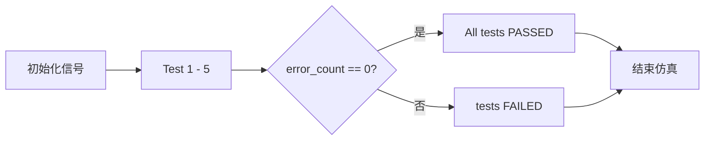
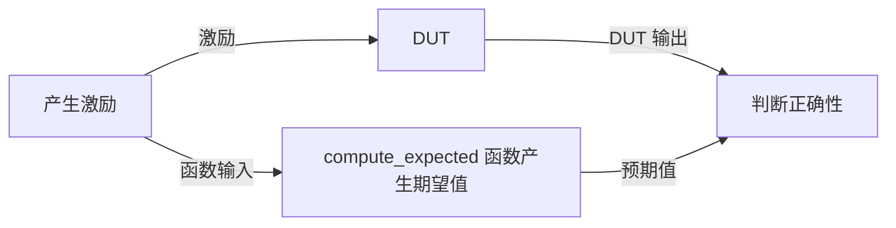

# Weight_Update 仿真验证

| 代码文件 | 路径 |
| -------- | ---- |
| 测试平台 | [srcs/sim/sim_weight_upd/tb_Weight_Update.sv](./tb_Weight_Update.sv) |
| 待测模块 | [srcs/modules/Weight_Update.sv](../../modules/Weight_Update.sv) |
| 模块文档 | [srcs/modules/submodules_doc/Weight_Update.md](../../modules/submodules_doc/Weight_Update.md) |

## 运行仿真

1. 打开 Vivado 工程
2. 在 Simulation Sources 中，将 sim_weight_upd 设为 active
3. Run Simulation 启动仿真

## 仿真概览

仿真流程：



数据流：



*测试平台采用双源比对策略，激励同时送入 DUT 和纯 SystemVerilog 行为模型 `compute_expected`。*

测试项目：

| 测试项 | 输入条件 | 行为 | 检查方式 |
| :--- | :--- | :--- | :--- |
| **Test 1** | STDP 模式 | 权重更新及上/下溢饱和限幅 | 自动检验 |
| **Test 2** | STDP 模式，x_pre: 0~15 | x_pre 衰减四舍五入 | 自动检验 |
| **Test 3** | SDSP 模式 | 方向增/减及饱和边界 | 自动检验 |
| **Test 4** | SDSP 模式 | learn_var 透传不变 | 自动检验 |
| **Test 5** | 论文给定输入 | 输出与论文一致 | 自动检验 |

## 验证与调试

### 控制台信息

测试平台含有自动验证功能，验证信息将输出至控制台。
仿真结束后，查看控制台是否有 `All tests PASSED` 消息即可确认模块正确性。

#### 成功示例

```log
[info|0] Logger initialized!
 
========== Starting Weight_Update Testbench ==========

 === Test 1: STDP weight update with saturation ===
 [info|16000] 
[STDP] Input:  weight=0x78 (0.937500)(120), learn_var=15
[STDP] Output: weight=0x7f (0.992188)(127), learn_var=13
Expected weight: 127 (saturated)
 [info|16000]   [AUTO-CHECK] PASS

 [info|26000] 
[STDP] Input:  weight=0x88 (-0.937500)(-120), learn_var= 0
[STDP] Output: weight=0x80 (-1.000000)(-128), learn_var= 0
Expected weight: -128 (saturated)
 [info|26000]   [AUTO-CHECK] PASS

 ......

 === Test 2: STDP x_pre decay (rounding) ===
 [info|56000] x_pre in= 0, out= 0 (correct expected =  0)
 [info|66000] x_pre in= 1, out= 1 (correct expected =  1)
 [info|76000] x_pre in= 2, out= 2 (correct expected =  2)
 [info|86000] x_pre in= 3, out= 3 (correct expected =  3)
 [info|96000] x_pre in= 4, out= 3 (correct expected =  3)
 
 ......
 
=== Test 3: SDSP direction and saturation ===
 [info|216000] 
[SDSP] Input:  weight=0x0a (0.078125)(10), learn_var= 1
[SDSP] Output: weight=0x0b (0.085938)(11), learn_var= 1
Expected weight: 11
 [info|216000]   [AUTO-CHECK] PASS

 [info|226000] 
[SDSP] Input:  weight=0x7f (0.992188)(127), learn_var= 1
[SDSP] Output: weight=0x7f (0.992188)(127), learn_var= 1
Expected weight: 127 (saturated)
 [info|226000]   [AUTO-CHECK] PASS

 ......

 === Test 4: SDSP learn_var passthrough ===
 [info|276000] 
[SDSP] Input:  weight=0x00 (0.000000)(0), learn_var= 1
[SDSP] Output: weight=0x01 (0.007812)(1), learn_var= 1
Expected learn_var: unchanged (passthrough)
 [info|276000]   [AUTO-CHECK] PASS

 === Test 5: Consistency with paper  ===
 [info|286000] 
[STDP] Input:  weight=0x86 (-0.953125)(-122), learn_var= 0
[STDP] Output: weight=0x80 (-1.000000)(-128), learn_var= 0
Expected learn_var: 0 (unchanged)
 [info|286000]   [AUTO-CHECK] PASS

 [info|296000] 
[STDP] Input:  weight=0xb4 (-0.593750)(-76), learn_var=10
[STDP] Output: weight=0xb6 (-0.578125)(-74), learn_var= 9
Expected learn_var: 9 (decremented)
 [info|296000]   [AUTO-CHECK] PASS

 [info|306000] 
[STDP] Input:  weight=0xf2 (-0.109375)(-14), learn_var= 4
[STDP] Output: weight=0xee (-0.140625)(-18), learn_var= 3
Expected learn_var: 3 (decremented)
 [info|306000]   [AUTO-CHECK] PASS

 Simulation completed: ALL CHECKS PASSED
 Total errors: 0
```

#### 失败示例

若校验失败，输出将显示具体错误：

```log

......

[info|306000] 
[STDP] Input:  weight=0xf2 (-0.109375)(-14), learn_var= 4
[STDP] Output: weight=0xee (-0.140625)(-18), learn_var= 4
Expected learn_var: 3 (decremented)
[error|306000]   [AUTO-CHECK] Mismatch! Expected x_pre=3, Got 4
Simulation completed: SOME CHECKS FAILED
Total errors: 3
$finish called at time : 306 ns
```

### 波形

可通过波形直观地查看运行结果或查看内部信号。


*波形配置文件：[srcs/sim/sim_weight_upd/tb_Weight_Update_behav.wcfg](./tb_Weight_Update_behav.wcfg)*
