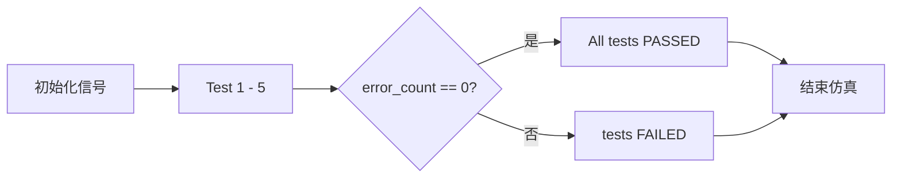
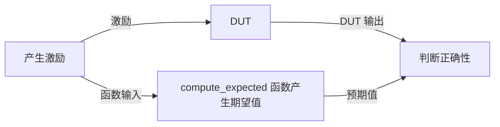
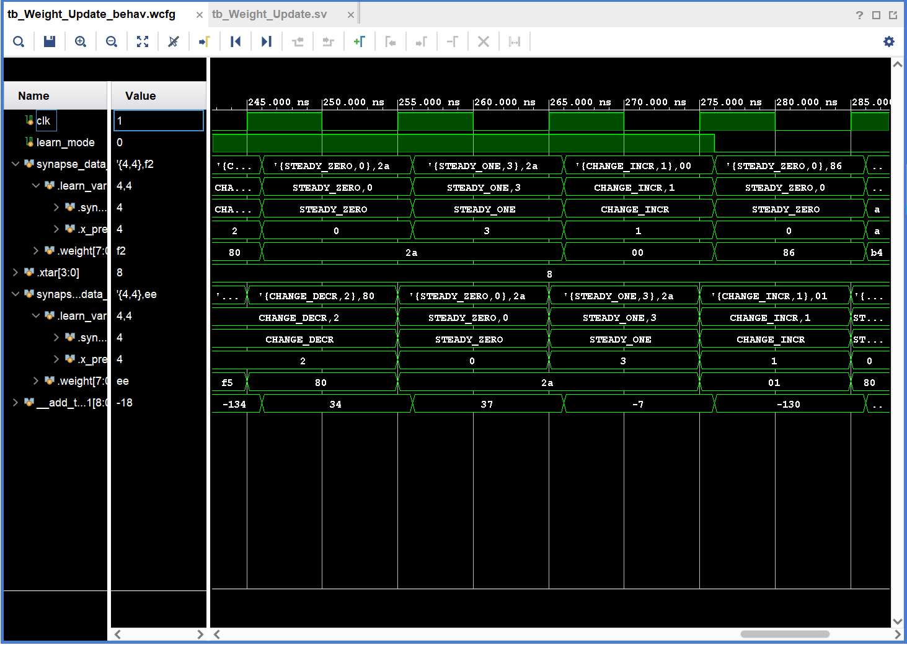

# Weight_Update 仿真验证

| 代码文件 | 路径 |
| -------- | ---- |
| 测试平台 | [srcs/sim/sim_weight_upd/tb_Weight_Update.sv](./tb_Weight_Update.sv) |
| 待测模块 | [srcs/modules/Weight_Update.sv](../../modules/Weight_Update.sv) |
| 模块文档 | [srcs/modules/submodules_doc/Weight_Update.md](../../modules/submodules_doc/Weight_Update.md) |

## 运行仿真

1. 打开 Vivado 工程
2. 在 Simulation Sources 中，将 sim_weight_upd 设为 active
3. Run Simulation 启动仿真

## 仿真概览

仿真流程：



数据流：



*测试平台采用双源比对策略，激励同时送入 DUT 和纯 SystemVerilog 行为模型 `compute_expected`。*

测试项目：

| 测试项 | 输入条件 | 行为 | 检查方式 |
| :--- | :--- | :--- | :--- |
| **Test 1** | STDP 模式 | 权重更新及上/下溢饱和限幅 | 自动检验 |
| **Test 2** | STDP 模式，x_pre: 0~15 | x_pre 衰减四舍五入 | 自动检验 |
| **Test 3** | SDSP 模式 | 方向增/减及饱和边界 | 自动检验 |
| **Test 4** | SDSP 模式 | learn_var 透传不变 | 自动检验 |
| **Test 5** | 论文给定输入 | 输出与论文一致 | 自动检验 |

## 验证与调试

### 控制台信息

测试平台含有自动验证功能，验证信息将输出至控制台。
仿真结束后，查看控制台是否有 `All tests PASSED` 消息即可确认模块正确性。

#### 成功示例

```txt
========== Starting Weight_Update Testbench ==========

=== Test 1: STDP weight update with saturation ===
[STDP] Input:  weight=0x78 (0.937500)(120), learn_var=15
[STDP] Output: weight=0x7f (0.992188)(127), learn_var=13
Expected weight: 127 (saturated)

  [AUTO-CHECK] PASS
[STDP] Input:  weight=0x88 (-0.937500)(-120), learn_var= 0
[STDP] Output: weight=0x80 (-1.000000)(-128), learn_var= 0
Expected weight: -128 (saturated)

......

Expected weight: -53

  [AUTO-CHECK] PASS
=== Test 2: STDP x_pre decay (rounding) ===
x_pre in= 0, out= 0 (correct expected =  0)
x_pre in= 1, out= 1 (correct expected =  1)
x_pre in= 2, out= 2 (correct expected =  2)

......

=== Test 3: SDSP direction and saturation ===
[SDSP] Input:  weight=0x0a (0.078125)(10), learn_var= 1
[SDSP] Output: weight=0x0b (0.085938)(11), learn_var= 1
Expected weight: 11

  [AUTO-CHECK] PASS
[SDSP] Input:  weight=0x7f (0.992188)(127), learn_var= 1
[SDSP] Output: weight=0x7f (0.992188)(127), learn_var= 1
Expected weight: 127 (saturated)


......

  [AUTO-CHECK] PASS
=== Test 4: SDSP learn_var passthrough ===
Input learn_var =  1, Output learn_var =  1
Expected: learn_var unchanged (passthrough)

  [AUTO-CHECK] PASS
=== Test 5: Consistency with paper  ===
Input learn_var =  0, Output learn_var =  0
  [AUTO-CHECK] PASS
Input learn_var = 10, Output learn_var =  9
  [AUTO-CHECK] PASS
Input learn_var =  4, Output learn_var =  3
  [AUTO-CHECK] PASS

========== Testbench completed ==========
All tests PASSED (auto-check).
```

#### 失败示例

若校验失败，输出将显示具体错误：

```txt

......

    [AUTO-CHECK] PASS
Input learn_var =  4, Output learn_var =  4
Error:   [AUTO-CHECK] Mismatch! Expected x_pre=3, Got 4
Time: 306 ns  Iteration: 0  Process: /tb_Weight_Update/Initial87_2/Block417_18  Scope: tb_Weight_Update.Block417_18  File: C:/MARTIN/verilog/Xilinx/projects_vivado/SNN_accelerator/srcs/sim/sim_weight_upd/tb_Weight_Update.sv Line: 428

========== Testbench completed ==========
ERROR: 3 test(s) FAILED (auto-check).
```

### 波形

可通过波形直观地查看运行结果或查看内部信号。



*波形配置文件：[srcs/sim/sim_weight_upd/tb_Weight_Update_behav.wcfg](./tb_Weight_Update_behav.wcfg)*
