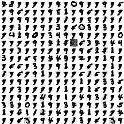

# 仿真训练文档

## _预备工作_

_**可选**，压缩包项目已执行过，生成内容为最新版本，无需重复执行_

1. 使用 VS2026 打开 [srcs\cpp_lib\hdf5_poisson_code_reader_for_dpic\hdf5_poisson_code_reader_for_dpic.slnx](../../cpp_lib/hdf5_poisson_code_reader_for_dpic/hdf5_poisson_code_reader_for_dpic.slnx) ， `release` 模式下编译
2. 运行 [srcs/dataset/input_gen.py](../../dataset/input_gen.py)
3. 运行 [srcs/copy_libs.ps1](../../copy_libs.ps1)

各步骤工具需求：

1. VS2026 ，vcpkg ，安装有 hdf5 库（需 C++ 发行版 ）并通过 MSBuild 集成到 VS 中
2. python ，安装有 numpy torch matplotlib snntorch 和 h5py 库
3. vivado2025，且在系统目录中

## 启动仿真

1. 右击激活仿真文件集 `train`
2. 仿真设置中关闭 `xsim.simulate.log_all_signals` （否则大幅影响训练速度）
3. 若不需要观察波形和调试，建议在 PROJECT MANAGER 中打开仿真文件集，选中 `train_behav.wcfg` ，在 properties 菜单中设置失能，同时启用 `train_no_log_behav.wcfg`，**以减少磁盘占用**。否则失能 `train_no_log_behav.wcfg` ，使能 `train_behav.wcfg`。

## 查看训练效果

1. 暂停仿真
2. 运行 [srcs\sim\train\get_synapse_ram.ps1](./get_synapse_ram.ps1)
3. 运行 [srcs\sim\train\coe_and_weight\draw_weight.py](./coe_and_weight/draw_weight.py)
4. 查看 [srcs\sim\train\coe_and_weight\weights_image.png](./coe_and_weight/weights_image.png)

结果示例：

## 断点恢复

若希望停止训练后，能重启仿真恢复上次训练进度，按如下步骤操作：

1. 停止本次训练前，待当前样本的所有时间步发送完毕，暂停仿真
2. 运行 [srcs\sim\train\get_synapse_ram.ps1](./get_synapse_ram.ps1) 保存突触数据
3. 运行 [srcs\sim\train\gen_resume_synapose_mem_coe.py](./coe_and_weight/gen_resume_synapose_mem_coe.py) 生成 coe 文件
4. 将 ip 核 `BRAM_12X65536` 的初始化文件替换为 [srcs\sim\train\ram_data.coe](./coe_and_weight/ram_data.coe)
5. 将 [srcs\sim\train\train.sv](./train.sv) 中第 51 行取消注释，查看训练时 tcl 控制台输出，找到最后一个样本的索引，替换为函数 `poisson::resume_breakpoint` 的参数
6. 停止本次训练，重启仿真
