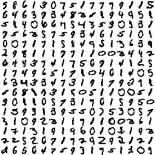
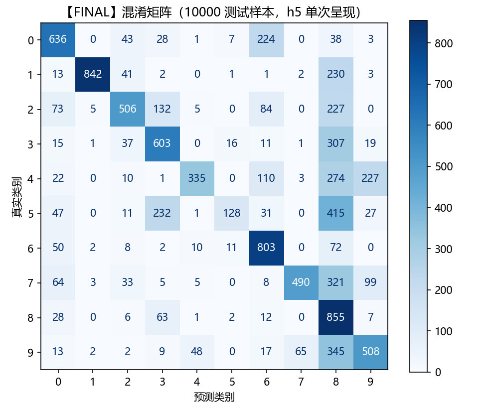

# 【FINAL】STDP 权重 — MNIST 准确率测试报告

- 被测权重: `【FINAL】ram_data_451_vthr1w_tref15_xtar11_hp5us.txt`

- 测试日期: 2026-09-27 20:13:00

- 方法: 论文 Diehl & Cook (2015) 第 2.6 节 (Training and Classification)


## 1. 网络与参数（与 FPGA 硬件一致）

| 项目 | 取值 |
|---|---|
| 输入图像 | 16x16 最大池化 MNIST（项目数据集） |
| 输入神经元 / 兴奋性神经元 | 256 / 256 |
| 输入编码 | 泊松脉冲，250 时间步，每步发放概率=像素强度 |
| 权重 | 8bit 有符号定点，范围 [-1,1)，存于 12bit 突触字低 8 位 |
| 膜电位 | 16bit 定点（低 7 位小数），范围 [0,512) |
| 阈值 v_thr | 35900.0 |
| 泄漏（膜电位衰减速率） | 每步 v -= shr_and_round(v, LEAK_SHIFT=4)（约 /16，可调全局常数） |
| 竞争(WTA) | 任一神经元发放后，下一时间步全部复位 |
| 不应期 | t_ref=0 |

## 2. 分类流程

1. 学习率置零、固定发放阈值；
2. 训练集完整呈现一次，按每个神经元对 10 类的平均响应指派类别标签（全流程唯一使用标签处）；
3. 测试样本按类内神经元平均发放率取 argmax 作为预测。

类别指派训练样本数: 60000；测试样本数: 10000；测试呈现次数: 1


## 3. 结果

- 单次呈现（h5 泊松脉冲，与硬件输入一致）: **57.06%**

- 弃真率（Type I error / FPR，macro 平均）: **4.76%**（把“不是该类”误判成该类）
- 取伪率（Type II error / FNR，macro 平均）: **43.41%**（把该类漏判成其他类）


### 每个类别分配的神经元数

| 类别 | 0 | 1 | 2 | 3 | 4 | 5 | 6 | 7 | 8 | 9 |
|---|---|---|---|---|---|---|---|---|---|---|
| 神经元数 | 27 | 59 | 16 | 24 | 19 | 35 | 18 | 32 | 4 | 22 |


### 神经元类别分布（16×16）与权重图对比

左图：每个格子 = 一个神经元，颜色/数字 = 该神经元被指派的数字类别；右图：权重图中第 (i,j) 个 16×16 方块是神经元 (i,j) 的感受野，二者逐格一一对应，可对照查看每个神经元学到的是哪个数字的原型。（该对比图由脚本运行时生成并直接嵌入本报告）

16×16 类别矩阵（txt 形式，同行号/列号即神经元坐标）：

```
   5  8  6  1  3  0  7  5  1  7  7  7  9  1  1  3
   5  4  6  3  7  3  4  8  2  5  1  9  4  9  5  1
   5  1  4  0  6  6  7  5  4  3  5  9  0  9  3  1
   7  5  6  2  5  7  5  9  3  4  6  1  5  1  0  0
   0  0  7  1  7  1  5  1  4  9  5  1  3  6  3  9
   2  9  8  1  1  1  7  7  1  1  0  0  2  4  4  2
   6  4  0  3  7  4  1  7  5  6  7  1  4  1  2  5
   1  7  4  9  6  5  1  7  1  0  4  6  1  4  0  5
   6  3  4  3  3  4  7  3  1  9  1  7  9  0  7  1
   5  5  8  1  7  3  1  5  0  5  1  1  0  0  5  1
   9  0  1  1  0  5  7  3  1  7  6  1  5  9  5  0
   1  5  9  3  1  3  9  5  5  0  7  5  3  0  5  7
   3  1  0  9  2  3  1  1  7  1  1  0  0  2  6  1
   1  7  1  3  1  9  1  9  6  0  1  0  1  1  9  3
   2  2  5  2  6  7  1  7  2  4  2  9  2  1  2  1
   2  6  5  6  4  7  5  9  3  1  7  5  1  1  0  7
```




### 各类别指标（h5 单次呈现：TP / FP / FN / TN / FPR / FNR / FDR）

> 口径：one-vs-rest；弃真率 FPR=FP/(FP+TN)，取伪率 FNR=FN/(FN+TP)，假发现率 FDR=FP/(TP+FP)（被判为该类的样本中误报比例）。

| 类别 | TP | FP | FN | TN | 弃真率(Type I/FPR) | 取伪率(Type II/FNR) | 假发现率(FDR) |
|---|---|---|---|---|---|---|---|
| 0 | 636 | 325 | 344 | 8695 | 3.60% | 35.10% | 33.82% |
| 1 | 842 | 13 | 293 | 8852 | 0.15% | 25.81% | 1.52% |
| 2 | 506 | 191 | 526 | 8777 | 2.13% | 50.97% | 27.40% |
| 3 | 603 | 474 | 407 | 8516 | 5.27% | 40.30% | 44.01% |
| 4 | 335 | 71 | 647 | 8947 | 0.79% | 65.89% | 17.49% |
| 5 | 128 | 37 | 764 | 9071 | 0.41% | 85.65% | 22.42% |
| 6 | 803 | 498 | 155 | 8544 | 5.51% | 16.18% | 38.28% |
| 7 | 490 | 71 | 538 | 8901 | 0.79% | 52.33% | 12.66% |
| 8 | 855 | 2229 | 119 | 6797 | 24.70% | 12.22% | 72.28% |
| 9 | 508 | 385 | 501 | 8606 | 4.28% | 49.65% | 43.11% |


### 混淆矩阵（h5 单次呈现，行=真实，列=预测）

> 混淆矩阵由 `sklearn.metrics.confusion_matrix` 实时计算、`ConfusionMatrixDisplay` 实时绘图；下方数字矩阵与图同源，各类别弃真/取伪率均由该矩阵按 one-vs-rest 口径推导。

```
          0     1     2     3     4     5     6     7     8     9
  0   636     0    43    28     1     7   224     0    38     3
  1    13   842    41     2     0     1     1     2   230     3
  2    73     5   506   132     5     0    84     0   227     0
  3    15     1    37   603     0    16    11     1   307    19
  4    22     0    10     1   335     0   110     3   274   227
  5    47     0    11   232     1   128    31     0   415    27
  6    50     2     8     2    10    11   803     0    72     0
  7    64     3    33     5     5     0     8   490   321    99
  8    28     0     6    63     1     2    12     0   855     7
  9    13     2     2     9    48     0    17    65   345   508
```




## 4. 结论与说明

*该【FINAL】权重由 FPGA 在线 STDP 训练导出，导出命名表明训练约进行至第 451 个样本（远少于论文的 60000 样本），且仅 256 神经元、16x16 输入、8bit 定点权重，因此准确率显著低于论文在 6400 神经元/28x28/全量训练下的 95%。*
